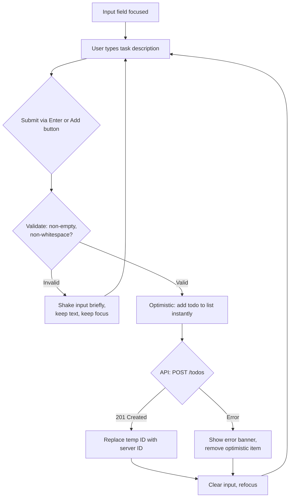
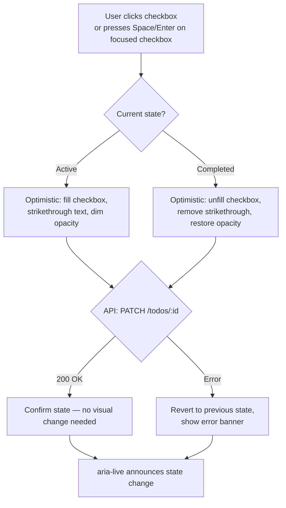
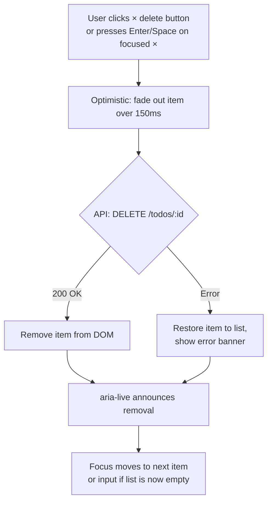
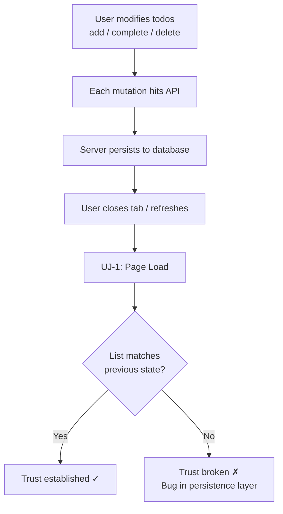

# UX Design Specification Todo App

**Author:** Arin
**Date:** 2026-04-28

---

<!-- UX design content will be appended sequentially through collaborative workflow steps -->

## Executive Summary

### Project Vision

A minimal, focused todo application where simplicity is the feature. One screen, four actions (create, view, complete, delete), zero onboarding. Every interaction is instant and every state is clear. The UX must make task management feel effortless across desktop and mobile.

### Target Users

Individual task managers who want a fast, reliable personal task tool without complexity. Moderate tech-savviness. Primary use on desktop browsers with frequent mobile usage. Values speed and clarity over feature richness.

### Key Design Challenges

1. **Single-screen density** — All functionality lives on one view. Must balance discoverability of all actions with visual simplicity and avoid clutter.
2. **State communication** — Five distinct states (loading, empty, populated, error, completed-item) must be immediately distinguishable without visual noise.
3. **Cross-viewport interaction design** — Touch targets and interaction patterns must work from 320px mobile to 1920px desktop without compromising either experience.

### Design Opportunities

1. **Zero-onboarding interface** — Layout and affordances so clear that 100% of users succeed on first attempt (SC-1).
2. **Micro-interactions** — Subtle animations for add, complete, and delete reinforce state changes and create a polished feel.
3. **Progressive disclosure for destructive actions** — Keep primary actions (add, complete) immediate while guarding delete behind a secondary gesture.

## Core User Experience

### Defining Experience

The core loop is **add → view → complete → delete**. Adding a todo is the most frequent action and must feel instant: cursor ready, type, Enter, done. The app exists to capture and clear tasks with zero friction.

### Platform Strategy

- **Primary:** Desktop web browser (keyboard-driven interaction)
- **Secondary:** Mobile web browser (touch-driven interaction)
- **No native app, no offline mode** — server-persisted, always-online
- **Responsive:** Single codebase adapting from 320px to 1920px

### Effortless Interactions

1. **Auto-focused input** — Cursor is in the add-todo input on page load. No click needed to start.
2. **Enter to submit** — Keyboard submission. Input clears and refocuses after add.
3. **One-click complete** — Single click/tap toggles completion. No confirmation dialog.
4. **Visible delete** — Delete action accessible per-item but visually secondary to prevent accidents.
5. **Instant feedback** — Optimistic UI updates; server confirmation happens silently in the background.

### Critical Success Moments

1. **First Task Added (0–3 seconds)** — User opens app, types, presses Enter, sees their todo. This is the make-or-break moment.
2. **Completion Reward** — Visual transition (strikethrough, fade, color shift) creates a "checked off" satisfaction.
3. **Trust Confirmation** — Page refresh shows all data intact. User trusts the app immediately.
4. **Error Recovery** — When something fails, user sees a clear message and can retry without losing work.

### Experience Principles

1. **Input-first** — The add-todo input is the visual and functional center of the interface.
2. **One action, one interaction** — Every user goal completes in a single gesture (click, tap, Enter).
3. **Show, don't tell** — State changes are communicated visually, not with alerts or toasts.
4. **Fail gracefully** — Errors are recoverable. User never loses entered data due to a failed request.

## Desired Emotional Response

### Primary Emotional Goals

- **In control** — The user feels they own their task list, not the other way around. The interface never surprises, nags, or gets in the way.
- **Productive** — Every interaction reinforces "I'm getting things done." Adding and completing tasks feels like momentum.
- **Calm** — The interface is quiet. No visual clutter, no notifications, no urgency signals. The app is a tool, not a distraction.

### Emotional Journey Mapping

| Stage              | Desired Emotion                          | Design Lever                             |
| ------------------ | ---------------------------------------- | ---------------------------------------- |
| First open         | Clarity — "I know exactly what to do"    | Auto-focused input, clean empty state    |
| Adding first task  | Momentum — "That was easy"               | Instant appearance, smooth animation     |
| Viewing task list  | Control — "I see everything"             | Clear hierarchy, active vs. completed    |
| Completing a task  | Satisfaction — "Done."                   | Strikethrough + visual reward transition |
| Deleting a task    | Confidence — "I meant to do that"        | Clean removal, no guilt or friction      |
| Error occurs       | Trust — "It'll be fine"                  | Clear message, obvious retry path        |
| Returning next day | Reliability — "Everything is still here" | Instant load, state preserved            |

### Micro-Emotions

- **Confidence over confusion** — Every affordance is self-explanatory. No tooltips needed.
- **Accomplishment over frustration** — Completing a todo feels like a small win, not just a checkbox toggle.
- **Trust over skepticism** — Data persistence is invisible but rock-solid. User never questions whether their todos are saved.

### Design Implications

- Confidence → Use standard, familiar patterns (checkbox for complete, × for delete). No novel interactions.
- Satisfaction → Completion animation should be noticeable but not flashy (subtle strikethrough + opacity shift, ~200ms).
- Calm → Neutral color palette, generous whitespace, no competing calls-to-action.
- Trust → No save button. Auto-save with silent background sync. Optimistic updates.

### Emotional Design Principles

1. **Invisible persistence** — The app saves automatically. Users should never think about saving.
2. **Quiet confidence** — No confirmation dialogs, no "are you sure?" prompts. The interface trusts the user.
3. **Small wins** — Each completed task is a visible achievement, not just a data change.
4. **No anxiety** — Errors are presented calmly with clear recovery. Nothing feels broken or urgent.

## UX Pattern Analysis & Inspiration

### Inspiring Products Analysis

**Apple Reminders (iOS/macOS)**

- Minimal, list-centric interface with immediate add via input at bottom
- One-tap completion with satisfying checkmark animation
- Clean visual hierarchy — content is king, chrome is minimal
- Weakness: Feature bloat in recent versions dilutes the simple core

**Todoist**

- Quick-add pattern: always-visible input, natural language parsing
- Visual distinction between complete/active is clear and immediate
- Excellent keyboard shortcuts for power users
- Weakness: Complexity creep — too many features visible at once for casual users

**Google Keep (Notes, not tasks — but the interaction)**

- Near-zero friction to create: just start typing
- Card-based layout communicates individual items clearly
- Color-coding adds personality without complexity
- Weakness: Not task-focused — no completion metaphor

### Transferable UX Patterns

**Navigation Patterns:**

- **Single-page, no navigation** (Apple Reminders simple mode) — everything visible at once. Perfect for our one-screen constraint.

**Interaction Patterns:**

- **Inline add** (Todoist) — input field always visible and ready, no modal or separate view.
- **Checkbox toggle** (universal) — the most universally understood "complete" pattern. Familiar to 100% of users.
- **Swipe/hover to reveal delete** (Apple Reminders) — secondary action hidden until needed, reducing visual noise.

**Visual Patterns:**

- **Strikethrough + muted opacity** (Todoist) — completed items remain visible but recede. Communicates "done" without removal.
- **Generous vertical spacing** (Apple Reminders) — each item breathes. Touch targets are naturally large.

### Anti-Patterns to Avoid

1. **Feature-overloaded toolbar** — Todoist's sidebar, filters, labels, and projects create decision fatigue. Our app has zero navigation.
2. **Confirmation dialogs for reversible actions** — "Are you sure you want to delete?" breaks flow. For a simple todo, just delete.
3. **Animated onboarding or tooltips** — If the interface needs explanation, the interface is wrong.
4. **Floating action buttons (FABs)** — Mobile pattern that obscures content and feels disconnected. Inline input is better.
5. **Multi-step creation flows** — Any todo app that opens a modal to create a task has failed the simplicity test.

### Design Inspiration Strategy

**Adopt:**

- Checkbox toggle for completion (universal pattern)
- Inline always-visible input field (Todoist pattern)
- Strikethrough + opacity for completed items (Todoist pattern)

**Adapt:**

- Apple Reminders' reveal-on-hover for delete → show delete icon inline but visually subdued (works for both mouse and touch)

**Avoid:**

- Any navigation, sidebar, or multi-view pattern
- Modals, confirmation dialogs, or multi-step flows
- FABs, tooltips, or onboarding overlays

## Design System Foundation

### Design System Choice

**Tailwind CSS** — utility-first CSS framework with custom design tokens.

No component library. Components are hand-built with semantic HTML, styled via Tailwind utilities. The app is simple enough that a component library adds more complexity than it removes.

### Rationale for Selection

1. **Right-sized** — 5 component types don't justify a 200+ component library. Tailwind gives us exactly what we need.
2. **Full visual control** — No fighting library defaults to achieve our calm, minimal aesthetic.
3. **Accessibility by design** — Semantic HTML (`<input>`, `<button>`, `<ul>/<li>`, `<checkbox>`) with ARIA attributes. No abstraction layer hiding accessibility concerns.
4. **Performance** — Purged Tailwind CSS produces <10KB of CSS. No JS runtime for styling.
5. **Responsive built-in** — Breakpoint utilities (`sm:`, `md:`, `lg:`) handle our 320–1920px requirement natively.

### Implementation Approach

- **Design tokens via Tailwind config** — colors, spacing, typography defined once in `tailwind.config.js`
- **Semantic HTML first** — `<form>`, `<input>`, `<button>`, `<ul>`, `<li>`, `<label>` with proper ARIA roles
- **Component isolation** — Each UI component (TodoInput, TodoItem, TodoList, EmptyState, ErrorMessage) is a self-contained unit
- **No CSS-in-JS** — Pure Tailwind utility classes, no runtime styling overhead

### Customization Strategy

**Design Tokens:**

- **Colors:** Neutral palette (grays) with one accent color for active state. Muted tones for completed items.
- **Typography:** System font stack (`font-sans`) — no custom fonts to load.
- **Spacing:** 4px base unit, generous vertical rhythm (12–16px between items).
- **Border radius:** Subtle rounding (4–8px) for inputs and items.
- **Transitions:** 150–200ms ease for completion and deletion animations.

## 2. Core User Experience

### 2.1 Defining Experience

**"Type → Enter → Done."**

The user opens the app, sees the input field already focused, types a task, presses Enter, and the todo appears in the list instantly. This 2-second loop is the entire product promise. If this feels instant and effortless, the app succeeds.

### 2.2 User Mental Model

Users bring the mental model of a **paper checklist**: write items, check them off, cross them out. The app must match this model exactly:

- **Adding** = writing on the next blank line
- **Completing** = checking a box / crossing off
- **Deleting** = erasing or tearing off
- **Viewing** = glancing at the list

No folders, no categories, no settings. One list. Users don't think "I'm using a task management application" — they think "I'm writing down what I need to do."

### 2.3 Success Criteria

1. **Speed** — From keystroke to visible todo: <200ms perceived latency.
2. **Predictability** — Every action produces exactly the expected result, every time.
3. **Reversibility** — No action feels dangerous. Completed items stay visible. Delete is permanent but not anxiety-inducing.
4. **Completeness** — Users never wonder "did that save?" The answer is always yes.

### 2.4 Novel UX Patterns

**Approach: 100% established patterns.** Zero novelty.

- Checkbox for completion — universal
- Text input + Enter for creation — universal
- × button for delete — universal
- List layout — universal

Innovation is in the **execution quality**, not the pattern selection. The app should feel like the platonic ideal of a todo list — the version users always wished existed but was always buried under features.

### 2.5 Experience Mechanics

**1. Initiation:**

- App loads → input field auto-focused → cursor blinking → user starts typing immediately
- No splash screen, no loading delay perceptible to user (optimistic empty state)

**2. Interaction:**

- User types task text (1–300 characters)
- Presses Enter (desktop) or taps Add button (mobile)
- Input clears and refocuses instantly
- New todo appears at top/bottom of list with subtle entrance animation (fade-in, ~150ms)

**3. Feedback:**

- **Add:** Todo appears in list instantly (optimistic update)
- **Complete:** Checkbox fills + text gets strikethrough + opacity dims (~200ms transition)
- **Delete:** Item slides out or fades out (~150ms transition)
- **Error:** Inline message appears below the affected area. Item reverts to pre-action state.

**4. Completion:**

- No explicit "done" state — the list IS the result
- User sees their todos, feels organized, closes the tab
- Next visit: everything is exactly as they left it

## Visual Design Foundation

### Color System

**Palette: Neutral-first with blue accent**

| Token              | Value                | Usage                           |
| ------------------ | -------------------- | ------------------------------- |
| `bg-primary`       | `#FFFFFF`            | Page background                 |
| `bg-surface`       | `#F9FAFB` (gray-50)  | Input field, card backgrounds   |
| `text-primary`     | `#111827` (gray-900) | Todo text, headings             |
| `text-secondary`   | `#6B7280` (gray-500) | Completed todo text, timestamps |
| `text-placeholder` | `#9CA3AF` (gray-400) | Input placeholder               |
| `accent`           | `#2563EB` (blue-600) | Active checkbox, focus ring     |
| `accent-hover`     | `#1D4ED8` (blue-700) | Hover states                    |
| `border`           | `#E5E7EB` (gray-200) | Input borders, dividers         |
| `error`            | `#DC2626` (red-600)  | Error messages                  |
| `error-bg`         | `#FEF2F2` (red-50)   | Error message background        |

**Contrast compliance:** All text/background combinations exceed WCAG AA 4.5:1 ratio.

### Typography System

**Font:** System font stack — `ui-sans-serif, system-ui, -apple-system, sans-serif`

| Element           | Size            | Weight | Line Height |
| ----------------- | --------------- | ------ | ----------- |
| App title         | 1.5rem (24px)   | 700    | 1.33        |
| Todo item text    | 1rem (16px)     | 400    | 1.5         |
| Completed todo    | 1rem (16px)     | 400    | 1.5         |
| Input text        | 1rem (16px)     | 400    | 1.5         |
| Placeholder       | 1rem (16px)     | 400    | 1.5         |
| Empty/error state | 0.875rem (14px) | 400    | 1.43        |

No custom web fonts — zero font loading latency.

### Spacing & Layout Foundation

**Base unit:** 4px
**Scale:** 4, 8, 12, 16, 24, 32, 48px

| Context                   | Spacing                             |
| ------------------------- | ----------------------------------- |
| Item padding (vertical)   | 12px                                |
| Item padding (horizontal) | 16px                                |
| Between items             | 0 (separated by 1px border)         |
| Input height              | 48px (mobile-friendly touch target) |
| Max content width         | 640px (centered)                    |
| Page padding              | 16px (mobile), 24px (desktop)       |

**Layout:** Single centered column, max-width 640px. No grid system needed — the app is a vertical list.

### Accessibility Considerations

- **Focus indicators:** 2px blue-600 outline with 2px offset on all interactive elements
- **Touch targets:** Minimum 44×44px for all tappable areas (checkbox, delete button)
- **Color independence:** Completion state communicated via strikethrough AND opacity, not color alone
- **Keyboard order:** Input → todo items (top to bottom) → each item's checkbox then delete
- **Screen reader:** `aria-label` on checkbox ("Mark [task] as complete"), delete button ("Delete [task]")
- **Live region:** `aria-live="polite"` on todo list for add/remove announcements

## Design Direction Decision

### Design Directions Explored

Three distinct visual directions were evaluated against the app's core experience principle ("Type → Enter → Done"), accessibility requirements (WCAG 2.1 AA), and the established design foundation:

| Direction              | Concept                                                          | Strengths                                                     | Weaknesses                                                                                   |
| ---------------------- | ---------------------------------------------------------------- | ------------------------------------------------------------- | -------------------------------------------------------------------------------------------- |
| **A: Ultra Minimal**   | Borderless white card, underline input, hover-reveal delete      | Maximum calm, minimal chrome                                  | Delete hidden on touch devices, low affordance for first-time users                          |
| **B: Bordered Cards**  | Individual bordered cards, visible Add button, square checkboxes | Clear touch targets, explicit affordances, universal patterns | Slightly more visual weight                                                                  |
| **C: Warm & Friendly** | Amber/cream palette, rounded forms, personality-driven copy      | Distinctive, inviting feel                                    | Warm palette diverges from neutral foundation, personality may feel forced for a utility app |

All directions were visualized with populated, empty, and error states in an interactive HTML showcase (`ux-design-directions.html`).

### Chosen Direction

**Direction B: Bordered Cards** — selected as the primary design direction.

Key characteristics:

- **Individual bordered cards** per todo item with rounded corners (8px)
- **Visible Add button** alongside the input field — works for both Enter (keyboard) and tap (touch)
- **Square checkboxes** (border-radius: 4px) — the most universally recognized "task complete" affordance
- **Always-visible delete button** in subdued gray, turning red on hover/focus — no hover-dependency
- **Blue accent** (#2563EB) for active checkbox fill and focus rings
- **8px gap** between cards for clear visual separation
- **Subtle elevation on hover** (box-shadow) for interactive feedback

### Design Rationale

1. **Accessibility first:** Individual cards with borders create unambiguous touch targets exceeding the 44×44px minimum. No functionality hidden behind hover states that fail on touch devices.
2. **Universal patterns:** Square checkboxes and a visible "Add" button match the mental model established by native OS task managers and dominant web apps (Todoist, Microsoft To Do).
3. **Keyboard + touch parity:** The Add button provides a visible tap target for mobile while Enter-to-submit still works for keyboard users — both paths are first-class.
4. **Neutral foundation preserved:** Uses the blue-on-white palette from Step 8 without deviation. Direction C's warm palette was rejected to maintain the professional, utility-focused identity.
5. **Scalability:** Bordered cards degrade gracefully as the list grows — each item remains visually distinct without relying on subtle background alternation.

### Implementation Approach

**Tailwind CSS mapping for Direction B components:**

```
Input container:  flex gap-2
Input field:      flex-1 border-2 border-gray-200 rounded-lg px-4 py-3 text-base
                  focus:border-blue-600 focus:ring-3 focus:ring-blue-600/10
Add button:       bg-blue-600 hover:bg-blue-700 text-white rounded-lg px-5 py-3
                  font-semibold text-sm
Todo card:        flex items-center bg-white border border-gray-200 rounded-lg
                  px-4 py-3 gap-3 hover:border-gray-300 hover:shadow-sm
Checkbox:         w-[22px] h-[22px] border-2 border-gray-300 rounded
                  checked: bg-blue-600 border-blue-600
Todo text:        flex-1 text-base text-gray-900
                  completed: line-through text-gray-400 opacity-70
Delete button:    text-gray-300 hover:text-red-600 hover:bg-red-50 rounded p-1
Todo list:        flex flex-col gap-2
```

**Key interaction details:**

- Input auto-focuses on page load
- Enter submits; Add button submits — identical behavior
- Checkbox toggle: 200ms fill transition
- Delete: item fades out over 150ms
- Error: inline banner below input with `bg-red-50 border-red-200 text-red-600`

## User Journey Flows

### UJ-1: View Todos (Page Load)

The entry point to every session. The app must go from URL to usable list in under 200ms perceived time.

```mermaid
flowchart TD
    A[User opens URL] --> B[Browser loads SPA shell]
    B --> C{API: GET /todos}
    C -->|200 OK| D{Response empty?}
    C -->|Network error| E[Show error banner:<br/>"Couldn't load todos. Retrying..."]
    E --> F[Auto-retry after 2s]
    F --> C
    D -->|Yes| G[Show empty state:<br/>"Your todo list is empty.<br/>Start by adding a task!"]
    D -->|No| H[Render todo list]
    H --> I[Active todos: normal style]
    H --> J[Completed todos: strikethrough + dimmed]
    G --> K[Focus input field]
    I --> K
    J --> K
```

**Key decisions:** Auto-retry on network failure (no user action required). Input auto-focuses regardless of list state.

### UJ-2: Add a Todo

The core flow — "Type → Enter → Done." Two equally valid submit paths (Enter key and Add button).



**Key decisions:** Optimistic update — the todo appears immediately, before the server responds. On failure, it's removed and an error banner explains why. Input clears and refocuses only after successful add.

### UJ-3: Complete a Todo

Toggle between active and completed states. Visual feedback within 200ms.



**Key decisions:** Completion is a toggle (not one-way). Completed items stay in-place in the list — no reordering. Screen reader announcement via `aria-live="polite"`.

### UJ-4: Delete a Todo

Destructive action — immediate with no confirmation dialog (per PRD, no confirmation required).



**Key decisions:** No confirmation modal — this is a lightweight app, and undo would add unnecessary complexity. Focus management after delete ensures keyboard users aren't stranded.

### UJ-5: Verify Persistence

Not a distinct UI flow — persistence is validated by the user through UJ-1 on subsequent visits. The key UX concern is that the experience must be identical across sessions.



**Key decisions:** No "saving..." indicators or spinners. Persistence is invisible when working correctly — the app just "remembers."

### UJ-6: Use on Mobile Device

Not a separate flow but a responsive variant of UJ-1 through UJ-4. Key adaptations:

- **Input + Add button:** Full width, stacked or side-by-side depending on viewport. 48px input height for touch.
- **Todo cards:** Full width, 44×44px minimum touch targets for checkbox and delete.
- **Delete button:** Always visible (no hover state on touch devices).
- **Viewport:** No horizontal scroll. 16px page padding. Max-width 640px auto-centers on tablet+.

### Journey Patterns

| Pattern                     | Used In          | Behavior                                                             |
| --------------------------- | ---------------- | -------------------------------------------------------------------- |
| **Optimistic update**       | UJ-2, UJ-3, UJ-4 | Apply change visually before server confirms; revert on error        |
| **Auto-focus management**   | UJ-1, UJ-2, UJ-4 | Input focused on load, after add, and after delete (if list empties) |
| **Error recovery**          | All              | Inline banner below input; auto-dismiss after 5s or on next action   |
| **aria-live announcements** | UJ-2, UJ-3, UJ-4 | Polite announcements for list mutations                              |
| **Keyboard parity**         | All              | Every action achievable via keyboard with logical tab order          |

### Flow Optimization Principles

1. **Zero-step start:** No onboarding, no login, no setup. URL → list → type.
2. **Optimistic everywhere:** Never make the user wait for the server. Show the result immediately, reconcile in the background.
3. **Error as exception:** Errors are rare (local network issues). Show inline, auto-dismiss, never block the flow.
4. **Focus continuity:** After every action, focus lands where the user's next action will be — input field for adding, next item for deleting.
5. **Touch = keyboard = mouse:** No interaction path is second-class. All three input methods reach every function.

## Component Strategy

### Design System Components

**Tailwind CSS provides:** utility classes for layout, spacing, typography, color, borders, shadows, transitions, and responsive breakpoints. No pre-built component library.

**What this means:** All components are hand-built using Tailwind utilities, but we're not designing from scratch — every component maps to well-established UI patterns with zero novelty.

### Custom Components

#### 1. TodoInput

**Purpose:** Captures new todo text and submits it.
**Anatomy:** Text input + Add button, side-by-side in a flex row.

| State                       | Input                                     | Button                           |
| --------------------------- | ----------------------------------------- | -------------------------------- |
| **Default**                 | `border-gray-200`, placeholder visible    | `bg-blue-600 text-white`         |
| **Focused**                 | `border-blue-600 ring-3 ring-blue-600/10` | unchanged                        |
| **Typing**                  | User text replaces placeholder            | unchanged                        |
| **Invalid submit**          | Brief shake animation, text preserved     | unchanged                        |
| **Disabled (during error)** | `opacity-50 pointer-events-none`          | `opacity-50 pointer-events-none` |

**Accessibility:** `<input type="text" aria-label="Add a new todo">`, `<button type="submit">Add</button>`. Form wraps both so Enter submits natively.
**Keyboard:** Tab to input → type → Enter submits. Tab to Add button → Enter/Space submits.

#### 2. TodoItem

**Purpose:** Displays a single todo with toggle and delete actions.
**Anatomy:** Checkbox + text + delete button in a bordered card row.

| State             | Checkbox                                      | Text                                    | Delete                                        | Card                        |
| ----------------- | --------------------------------------------- | --------------------------------------- | --------------------------------------------- | --------------------------- |
| **Active**        | Empty, `border-gray-300`                      | `text-gray-900`                         | `text-gray-300`                               | `border-gray-200`           |
| **Active:hover**  | unchanged                                     | unchanged                               | unchanged                                     | `border-gray-300 shadow-sm` |
| **Completed**     | Filled `bg-blue-600`, checkmark               | `line-through text-gray-400 opacity-70` | `text-gray-300`                               | `border-gray-200`           |
| **Delete:hover**  | —                                             | —                                       | `text-red-600 bg-red-50`                      | —                           |
| **Focus-visible** | `outline-2 outline-blue-600 outline-offset-2` | —                                       | `outline-2 outline-blue-600 outline-offset-2` | —                           |

**Accessibility:** Checkbox: `<input type="checkbox" aria-label="Mark [task] as complete">`. Delete: `<button aria-label="Delete [task]">`. Card: `<li>` inside `<ul>`.
**Keyboard:** Tab into card → checkbox focused → Space/Enter toggles → Tab → delete focused → Space/Enter deletes.

#### 3. TodoList

**Purpose:** Renders the ordered list of TodoItem components.
**Anatomy:** `<ul>` with `flex flex-col gap-2`. Contains TodoItem `<li>` elements.

| State                 | Behavior                                             |
| --------------------- | ---------------------------------------------------- |
| **Populated**         | Renders all items in creation order                  |
| **Empty**             | Shows EmptyState component                           |
| **Loading (initial)** | No skeleton/spinner — list appears once data arrives |

**Accessibility:** `<ul role="list" aria-label="Todo list" aria-live="polite">`. Live region announces additions/removals.

#### 4. EmptyState

**Purpose:** Shown when the todo list has zero items.
**Anatomy:** Centered text message within the list area.
**Content:** "Your todo list is empty. Start by adding a task!"
**Styling:** `text-center py-10 text-gray-400 text-sm`
**Accessibility:** Visible text is sufficient — no additional ARIA needed.

#### 5. ErrorBanner

**Purpose:** Displays inline error messages for failed API operations.
**Anatomy:** Icon + message text in a colored banner below the input.

| State            | Behavior                                                                        |
| ---------------- | ------------------------------------------------------------------------------- |
| **Visible**      | `bg-red-50 border border-red-200 text-red-600 rounded-lg px-4 py-3` with ⚠ icon |
| **Auto-dismiss** | Fades out after 5 seconds or on next successful action                          |
| **Hidden**       | Not rendered in DOM                                                             |

**Accessibility:** `role="alert"` so screen readers announce immediately. No user action required to dismiss.

### Component Implementation Strategy

**No component library, no abstractions beyond what's needed:**

- Each component is a single file (or function component)
- Tailwind classes applied directly — no CSS abstraction layer
- State managed at the app level, components receive props
- Transitions via Tailwind's `transition-all duration-150` / `duration-200`

**Component hierarchy:**

```
App
├── TodoInput (form: input + button)
├── ErrorBanner (conditional)
└── TodoList (ul)
    ├── TodoItem (li) × N
    └── EmptyState (conditional, when N = 0)
```

### Implementation Roadmap

All 5 components are needed for MVP — there are no phases. Build order follows dependency:

1. **TodoInput** — enables adding (UJ-2)
2. **TodoItem** — enables viewing/completing/deleting (UJ-1, UJ-3, UJ-4)
3. **TodoList** — composes TodoItems (UJ-1)
4. **EmptyState** — handles zero-item case (UJ-1 empty state)
5. **ErrorBanner** — handles failures (all UJs error path)

Total: 5 components. No additional components anticipated.

## UX Consistency Patterns

### Button Hierarchy

The app has exactly 3 button types. No ambiguity.

| Level                  | Button     | Styling                                                                              | Usage                                       |
| ---------------------- | ---------- | ------------------------------------------------------------------------------------ | ------------------------------------------- |
| **Primary**            | Add        | `bg-blue-600 text-white hover:bg-blue-700 rounded-lg px-5 py-3 font-semibold`        | One instance — the Add button next to input |
| **Icon (destructive)** | Delete (×) | `text-gray-300 hover:text-red-600 hover:bg-red-50 rounded p-1`                       | One per todo item                           |
| **Toggle**             | Checkbox   | `w-[22px] h-[22px] border-2 border-gray-300 rounded` → `bg-blue-600 border-blue-600` | One per todo item                           |

**Rules:**

- No secondary/tertiary/ghost buttons needed — scope is too small
- Primary button uses `cursor-pointer`; all buttons use `transition-colors duration-150`
- Disabled state (during error): `opacity-50 cursor-not-allowed`

### Feedback Patterns

| Feedback Type            | Trigger                               | Presentation                                                                | Duration                             | ARIA                                                         |
| ------------------------ | ------------------------------------- | --------------------------------------------------------------------------- | ------------------------------------ | ------------------------------------------------------------ |
| **Error**                | API failure (save/toggle/delete/load) | Red banner below input: `bg-red-50 border-red-200 text-red-600` with ⚠ icon | 5s auto-dismiss or until next action | `role="alert"`                                               |
| **Validation rejection** | Empty/whitespace submit               | Input shakes briefly (CSS animation, ~300ms). No banner.                    | Immediate                            | Input retains `aria-invalid="true"` until valid text entered |
| **Optimistic success**   | Add/complete/delete                   | Immediate visual change (item appears, strikethrough, fade-out)             | Permanent (or reverted on error)     | `aria-live="polite"` on list                                 |
| **Confirmed success**    | Server 200 response                   | No additional feedback — optimistic state was already correct               | —                                    | —                                                            |

**Rules:**

- No toast notifications, snackbars, or modal alerts — always inline
- No success banners — the UI state IS the feedback
- Error is the only state that produces a visible banner
- Never block user input during error display

### Form Patterns

The app has exactly one form: the TodoInput. Pattern rules for consistency:

**Validation:**

- Client-side: reject empty/whitespace-only strings before API call
- No character limit enforcement in UI (server enforces FR-3: 255 chars)
- No real-time validation as user types — only on submit
- Invalid submit: shake + keep text + keep focus. No error text needed (the constraint is obvious)

**Input behavior:**

- Placeholder: "Add a new todo..." in `text-gray-400`
- Auto-focus on page load and after successful add
- `autocomplete="off"` — no browser suggestions for todo text
- `spellcheck="true"` — standard spell checking

**Submit behavior:**

- Enter key and Add button are identical paths
- Input clears only on success, never on failure
- No debounce — immediate submit on each action

### State Transition Patterns

Consistent animation timing across all state changes:

| Transition           | Duration | Easing      | Property                       |
| -------------------- | -------- | ----------- | ------------------------------ |
| Checkbox fill        | 200ms    | ease-in-out | background-color, border-color |
| Text strikethrough   | 200ms    | ease-in-out | opacity, text-decoration       |
| Item delete (fade)   | 150ms    | ease-out    | opacity, height                |
| Card hover shadow    | 150ms    | ease-in-out | box-shadow, border-color       |
| Button hover color   | 150ms    | ease-in-out | background-color               |
| Error banner appear  | 200ms    | ease-out    | opacity                        |
| Error banner dismiss | 300ms    | ease-in     | opacity                        |
| Input shake          | 300ms    | ease-in-out | transform (translateX)         |

**Rules:**

- All transitions use Tailwind's `transition-*` utilities — no custom CSS animations except input shake
- No motion if `prefers-reduced-motion: reduce` — transitions set to 0ms

## Responsive Design & Accessibility

### Responsive Strategy

**Mobile-first, single-column layout.** The 640px max-width means the app is already "mobile" at every breakpoint — the only responsive concern is padding and touch target sizing.

| Viewport         | Width       | Behavior                                                      |
| ---------------- | ----------- | ------------------------------------------------------------- |
| **Small mobile** | 320px–374px | Full bleed, 16px padding. Input + Add button stack vertically |
| **Mobile**       | 375px–639px | Full bleed, 16px padding. Input + Add button side-by-side     |
| **Tablet+**      | 640px+      | Content centered with `max-w-[640px] mx-auto`, 24px padding   |

**No layout changes beyond this.** No sidebar, no multi-column, no hamburger menu. The app is a vertical list at every size.

### Breakpoint Strategy

**Tailwind breakpoints used:**

| Breakpoint     | Tailwind class | Purpose                          |
| -------------- | -------------- | -------------------------------- |
| Default (0px+) | —              | Mobile-first base styles         |
| `sm` (640px)   | `sm:`          | Center content, increase padding |

**Only one breakpoint is needed.** Below 640px: full width. At 640px+: centered column. No `md`, `lg`, or `xl` breakpoints required.

**Implementation:**

```
Container: w-full sm:max-w-[640px] sm:mx-auto px-4 sm:px-6
Input row: flex flex-col sm:flex-row gap-2
```

### Accessibility Strategy

**Compliance target:** WCAG 2.1 Level AA (per NFR-11).

#### Semantic HTML Structure

```html
<main>
  <h1>My Todos</h1>
  <form>
    <!-- TodoInput -->
    <input type="text" />
    <button type="submit">Add</button>
  </form>
  <div role="alert"></div>
  <!-- ErrorBanner (conditional) -->
  <ul role="list" aria-label="Todo list" aria-live="polite">
    <li>
      <!-- TodoItem -->
      <input type="checkbox" />
      <span>Todo text</span>
      <button>Delete</button>
    </li>
  </ul>
</main>
```

#### Color Contrast Compliance

| Pair           | Foreground | Background | Ratio  | Requirement                                     |
| -------------- | ---------- | ---------- | ------ | ----------------------------------------------- |
| Primary text   | `#111827`  | `#FFFFFF`  | 18.4:1 | AA ≥ 4.5:1 ✓                                    |
| Completed text | `#9CA3AF`  | `#FFFFFF`  | 3.0:1  | Enhanced by strikethrough + opacity (multi-cue) |
| Placeholder    | `#9CA3AF`  | `#FFFFFF`  | 3.0:1  | Not required (decorative)                       |
| Error text     | `#DC2626`  | `#FEF2F2`  | 5.1:1  | AA ≥ 4.5:1 ✓                                    |
| Button text    | `#FFFFFF`  | `#2563EB`  | 4.9:1  | AA ≥ 4.5:1 ✓                                    |

#### Keyboard Navigation

| Key         | Context          | Action                                                                       |
| ----------- | ---------------- | ---------------------------------------------------------------------------- |
| Tab         | Page             | Cycle through: input → Add → checkbox₁ → delete₁ → checkbox₂ → delete₂ → ... |
| Enter       | Input focused    | Submit todo                                                                  |
| Enter/Space | Checkbox focused | Toggle completion                                                            |
| Enter/Space | Delete focused   | Delete todo                                                                  |
| Shift+Tab   | Any              | Reverse tab order                                                            |

**Focus management rules:**

- Page load: input auto-focused
- After add: input refocused
- After delete: focus moves to next item's checkbox, or input if list is empty
- Focus ring: `outline-2 outline-blue-600 outline-offset-2` on all interactive elements
- Skip link: `<a href="#todo-input" class="sr-only focus:not-sr-only">Skip to add todo</a>` at top of page

#### Screen Reader Support

| Component    | ARIA                                   | Announcement                                            |
| ------------ | -------------------------------------- | ------------------------------------------------------- |
| Input        | `aria-label="Add a new todo"`          | "Add a new todo, text input"                            |
| Add button   | Visible text "Add"                     | "Add, button"                                           |
| Checkbox     | `aria-label="Mark [task] as complete"` | "Mark Buy groceries as complete, checkbox, not checked" |
| Delete       | `aria-label="Delete [task]"`           | "Delete Buy groceries, button"                          |
| Todo list    | `aria-live="polite"`                   | Announces when items added/removed                      |
| Error banner | `role="alert"`                         | Announces error immediately                             |
| Empty state  | Static text                            | Read normally when list region is focused               |

#### Reduced Motion

```css
@media (prefers-reduced-motion: reduce) {
  * {
    transition-duration: 0ms !important;
    animation-duration: 0ms !important;
  }
}
```

All transitions (checkbox fill, item fade, card hover, error banner) instantly complete. Functionality unchanged.

### Testing Strategy

**Automated:**

- axe-core or Lighthouse accessibility audit in CI — must pass with 0 violations
- HTML validation — semantic structure check

**Manual (per NFR-10 browser matrix):**

- Chrome (latest), Firefox (latest), Safari (latest), Edge (latest)
- iOS Safari, Android Chrome
- Keyboard-only navigation through all 6 user journeys
- VoiceOver (macOS/iOS) + NVDA (Windows) screen reader walkthrough

**Checklist per UJ:**

- [ ] All actions reachable via keyboard
- [ ] Focus visible on every interactive element
- [ ] Screen reader announces all state changes
- [ ] Touch targets ≥ 44×44px on mobile
- [ ] No horizontal scroll at 320px viewport
- [ ] Color not sole indicator of any state

### Implementation Guidelines

**For the developer agent — key rules:**

1. **HTML first:** Use semantic elements (`<form>`, `<ul>`, `<li>`, `<input>`, `<button>`) — not divs with ARIA roles
2. **Mobile-first CSS:** Base styles are mobile. Only use `sm:` prefix for 640px+ adjustments
3. **Rem units:** All font sizes, spacing, and breakpoints in rem — never px in CSS (px only in Tailwind config)
4. **Touch targets:** Add `min-h-[44px] min-w-[44px]` to checkbox and delete button containers
5. **Focus visible:** Use `focus-visible:` (not `focus:`) for keyboard-only focus rings
6. **Reduced motion:** Wrap all transitions in `motion-safe:` Tailwind variant
7. **Test at 320px:** The minimum viewport width. Nothing should overflow or require horizontal scroll
